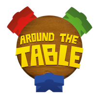
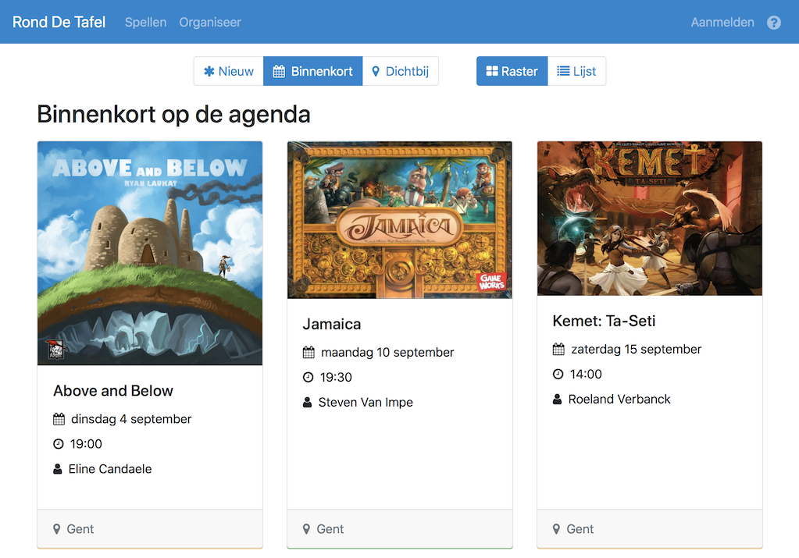

    

# Around The Table

Around The Table is an open source platform that supports tabletop gaming communities. Players can use it to host games and connect with other players in their area.

## Features

### Integration with BoardGameGeek

Hosting a game could not be easier. Select the game you want from the results provided by BoardGameGeek and we'll do the rest. This means less information for you to enter and less room for errors.

### Sign in with Facebook

If you have a Facebook account, you can use that to sign in to our website. If not, there's always the option of creating an account yourself.

### Search in your area

If you set a location, you can sort the available games by distance and quickly see what's going on in your area.

### Chat

An in-site chat feature lets you connect with hosts and players and make new friends.

### Mobile

Our website is designed to be used on anything from a smartphone to a desktop computer and will adjust its content accordingly, giving you a smooth experience, no matter the device you use.

### Privacy

We value our privacy and respect yours. We do not store any more information than we need and do not use plugins that track you.

### Not-for-profit

Around The Table is a not-for-profit project. Our platform is free of charge and free of ads.

    

## Help out

There's many more [features](https://github.com/pwsacademy/around-the-table/labels/Feature) we'd like to implement. If you're a developer, we invite you to help out. Visit our [wiki](https://github.com/pwsacademy/around-the-table/wiki) to get started.
